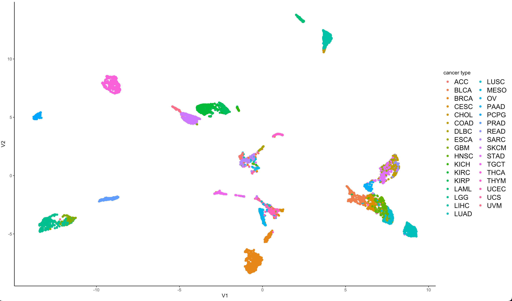
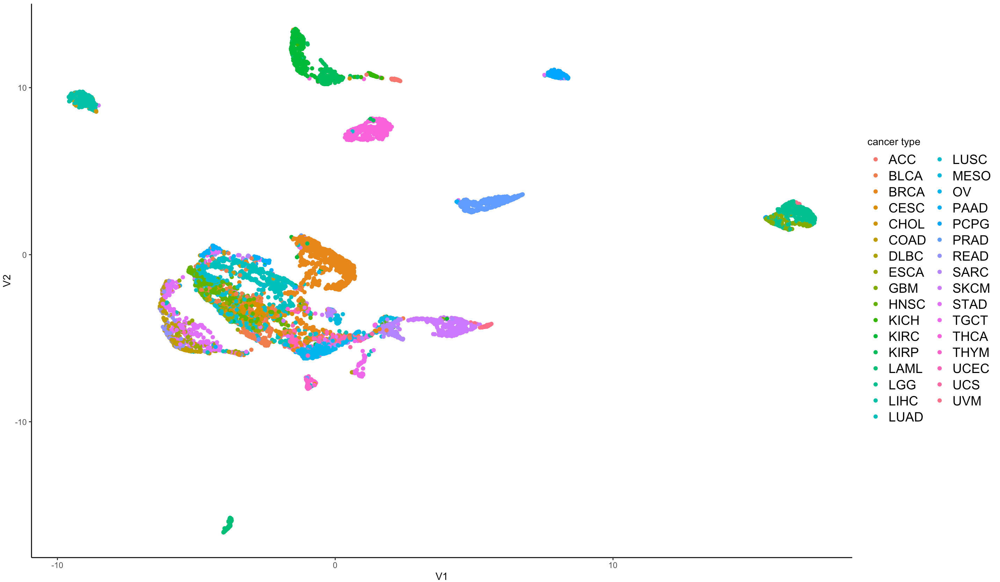

```{=tex}
\begin{titlepage}
\centering
    {\Large Ruprecht-Karls-Universität Heidelberg\\
        Fakultät für Biowissenschaften\\
        Bachelorstudiengang Molekulare Biotechnologie\\}

    {\vspace{\stretch{2}}}
    {\doublespacing{\usekomafont{title}}

        {\Huge Cancer Hallmark and Metabolic Pathways in Cancer}

      {\Huge Topic 02 Team 03}

        {\Huge Exploration of Lung Adenocarcinoma (LUAD)}

    }

    \vspace{\stretch{2}}
    {\Large Data Science Project SoSe 2022}

    \vspace{\stretch{2}}

    {\Large
        \begin{tabular}{rl}
            Autoren & Paul Brunner, Marie Kleinert, Felipe Stünkel, Chloé Weiler\\
            Abgabetermin &18.07.2022\\
        \end{tabular}
    }

    \vspace{\stretch{1}}

\end{titlepage}
```
# Introduction

## Biological Background

To this day, lung cancer is the leading cause of cancer death worldwide [@zhang2020]. Lung adenocarcinomam (LUAD) is a form of non-small cell lung cancer which accounts for approximately 40% of lung cancer cases [@wang2020] and which is characterized by a remarkably low 5-year overall survival rate of merely 18% [@li2022]. In theory, every cell is capable of developing into a cancer cell through acquisition of so-called hallmark capabilities that essentially cause metabolic reprogramming, immune evasion and uncontrolled proliferation due to numerous genetic mutations \[@hanahan2011\]\[@peng2018\]. In order to gain an insight into which mutations drive cancer development and how to best treat different cancer types, one must start by deciphering the intricate workings of gene expression regulation within a tumor cell. In our case this feat was achieved with the help of the pan cancer project.

## The Pan Cancer Project

The Cancer Genome Atlas (TCGA) is a publicly available collection of datasets that store the most important cancer-causing genomic alterations in order to create an 'atlas' of cancer genomic profiles. [@tomczak2015]. In 2012 TCGA Research Network launched the Pan-Cancer analysis project as a globally coordinated initiative whose main objective is to assemble coherent, consistent TCGA datasets across twelve different tumor types, one of which being lung adenocarcinoma (LUAD). Each tumor type is characterized using six different genomic, proteomic, epigenomic, and transcriptional platforms. Data collected from thousands of patients is analysed and interpreted in an attempt to gain a deeper understanding of the genomic changes that drive a normal cell to become cancerous. In the future, the aim is to analyse additional tumor types beyond the twelve original ones in the hopes that the pan cancer project will one day inform clinical decision-making and aid in the development of novel therapeutic options [@weinstein2013].

## Jaccard index

The Jaccard index is a widely known measure for the similarity between finite sample sets. The restricted domain ranges from zero to one. A Jaccard index close to one indicates a high similarity of the sample sets [@jaccard1901].

$$
J(A,B)
= \frac{A \cap B}{A \cup B}
$$

## Principal Component Analysis (PCA)

Principal component analysis (PCA) is a procedure used to perform linear dimension reduction. The goal is to reduce the dimension of a given dataset whilst losing as little information as possible by retaining a maximum of the standardized dataset's variation [@ringner2008].

Principal components (PC) are a set of new orthogonal variables that are made up of a linear combination of the original variables. Principal components display the pattern of similarity of the observations and of the variables as points in maps [@abdi2010]. By convention, the PCs are ordered in decreasing order according to the amount of variation they explain of the original data [@ringner2008]. It is important to note that all PCs are uncorrelated.

PCA is a useful tool for genome-wide expression studies and often serves as a first step before clustering or classification of the data. Dimension reduction is a necessary step for easy data exploration and visualization [@ringner2008].

## Uniform Manifold Approximation and Projection (UMAP)

Uniform manifold approximation and projection (UMAP) is a k-neighbour graph based algorithm that is used for nonlinear dimension reduction [@smets2019] [@mcinnes2018].

After data normalization, the Euclidean distances between points in a two-dimensional space of the graph are calculated and a local radius is determined [@VERMEULEN2021119547]. In general the closer two points are to each other, the more similar they are. UMAP makes a density estimation to find the right local radius. This variable radius is smaller in high density regions of data points and larger in low density regions. In general, the density is higher when the k-nearest neighbour is close and vice versa. The number of k-nearest neighbours controls the number of neighbours whose local topology is preserved. Precisely, a large number of neighbours will ensure that more global structure is preserved whereas a smaller number of neighbours will ensure the preservation of more local structure [@mcinnes2018].

UMAP is a newer method than PCA and it is generally believed to be easier to interpret and to group data than by using PCA. Furthmore, UMAP has the advantage of not requiring linear data [@milosevic2022].

## Gene Set Enrichment Analysis (GSEA)

Gene set enrichment analysis (GSEA) is a computational method that is used to determine whether two gene expression states are significantly different from each other or not [@subramanian2007]. In this project we compared gene expression profiles between healthy and tumorous tissue of LUAD.

Two datasets are compared and the genes are sorted from the most to the least differential expression between the datasets according to their p-values. This creates a ranked list L.

Referring to an *a priori* defined set of genesets S, the goal is to locate for each pathway of S where its corresponding genes fall in L and find a discerning trend. If the genes of a given pathway are randomly distributed in L then the pathway is assumed to not significantly contribute to the particular tumor's phenotype. However if the genes are primarily clustered at the top or the bottom of L then a phenotypic significance of the given pathway can be assumed.

To determine the location of the genes, an enrichment score is calculated for each pathway. For this, a running-sum statistic is calculated as the list L is ran through. The running-sum is increased every time a gene belonging to the pathway in question is encountered and decreased otherwise. An enrichment score is thus calculated for each pathway. The enrichment score is defined as the maximum deviation from zero of the running-sum.

Lastly, adjustment for multiple hypothesis testing is performed by normalizing the enrichment score for each pathway to account for its size and a normalized enrichment score is obtained.

GSEA is a useful tool for interpretation of gene expression data.

[@subramanian2005]

## Gene Set Variation Analysis (GSVA)

Gene set variation analysis (GSVA) is an unsupervised method to estimate pathway activities based on gene expression data. Contrarily to the aforementioned GSEA, GSVA does not rely on phenotypic characterisation of the datasets into two categories but rather quantifies enrichment in a sample-wise manner which makes GSVA the better choice to perform on the tcga_exp dataset.

GSVA estimates a cumulative distribution for each gene over all samples. The gene expression values are then converted according to these estimated cumulative distributions into scaled values. Based on these new values, the genes are ranked in each sample. Next, the genes are classified into two distributions and a Komogorow-Smirnow statistic is calculated to judge how similar the distributions are to each other and to obtain an ES.

The GSVA corresponds to either the maximum deviation between both running sums or the GSVA score can be defined as the difference of the maximum deviations in the positive and in the negative direction. A highly positive or negative GSVA score indicates that the studied geneset is positively or negatively enriched compared to the genes not in the geneset, respectively. If the GSVA score for a given geneset is close to zero, then the geneset is probably not differentially expressed compared to the genes not in the geneset.

[@hanzelmann2013]

# Abbreviations

|         |                                                                  |
|---------|------------------------------------------------------------------|
| AML     | Acute myeloid leukemia                                           |
| AUC     | Area under the curve                                             |
| BRCA    | Breast cancer                                                    |
| CALCA   |                                                                  |
| CESC    | Cervical squamous cell carcinoma and endocervical adenocarcinoma |
| DLBC    | Lymphoid Neoplasm Diffuse Large B-cell Lymphoma                  |
| EMT     | Epithelial to mesenchymal transition                             |
| ESCA    | Esophageal carcinoma                                             |
| FGA     | Fibrinogen alpha chain                                           |
| GBM     | Glioblastoma multiformae                                         |
| GSEA    | Gene Set Enrichment Analysis                                     |
| GSVA    | Gene Set Variation Analysis                                      |
| INSL4   | Gene encoding insulin-like 4 protein                             |
| KICH    | Kidney chromophobe                                               |
| KIRC    | Kidney renal clear-cell carcinoma                                |
| KIRP    | Kidney renal papillary cell carcinoma                            |
| LGG     | Low grade glioma                                                 |
| LIHC    | Liver hepatocellular carcinoma                                   |
| LUAD    | Lung adenocarcinoma                                              |
| MSigDB  | Molecular Signature Database                                     |
| PAAD    | Pancreatic adenocarcinoma                                        |
| PC      | Principal component                                              |
| PCA     | Principal Component Analysis                                     |
| PCPG    | Pheochromocytoma and Paraganglioma                               |
| PRAD    | Prostate adenocarcinoma                                          |
| RNA-seq | RNA sequencing                                                   |
| ROC     | Receiver operating characteristic                                |
| SARC    | Sarcoma                                                          |
| TCGA    | The Cancer Genome Atlas                                          |
| TPM     | Transcripts per million                                          |
| UMAP    | Uniform Manifold Approximation and Projection                    |
| UVM     | Uveal melanoma                                                   |

# Methods

## Our Data

At the beginning of this project we were given four datasets, two of which contained RNA-seq data, one of which contained clinical annotations pertaining to one of the RNA-seq data frames and one of which contained a list of genesets for cancer hallmark analysis.

The first RNA-seq dataset is a data frame containing RNA-seq data from almost 10,000 TCGA cancer patients for 33 different tumor types. The data stored within that data frame was used to perform pan cancer analysis and to create a logistic regression model. The second RNA-seq dataset is a smaller data frame containing the TCGA expression data of tumor tissue and the corresponding healthy tissue for five different cancer types. A focused analysis was performed on this second dataset.

RNA sequencing (RNA-seq) data makes it possible to go beyond static genome analysis and to gain an insight into the transcriptional landscape of a cell. Studying gene expression profiles of a given cell through monitoring RNA synthesis enables researchers to gain a deeper understanding of how gene expression is regulated in cells and its impact on the cell's phenotype [@marguerat2010].

All expression data was log2(TPM) transformed. Log2 Transformation is a commonly used tool to reduce skewness in data and to make it more conform to a normal distribution. Here, TPM stands for 'Transcripts per million' and refers to a method of RNA-seq normalization in which one first accounts for gene length before adjusting for sequencing depth. A possible perk of TPM is the reduction of type I and type II errors which would otherwise falsify downstream analysis results by accounting for gene length first [@yuen2022].

## Overview of used packages

+-----------------+--------------------------------------------------------------------------------------------+--------------------+
| Package Name    | Application                                                                                | **Reference**      |
+=================+============================================================================================+====================+
| babyplots       | create interactive 3D visualizations                                                       | @babyplots         |
+-----------------+--------------------------------------------------------------------------------------------+--------------------+
| base            | basic R functions                                                                          | @R-base            |
+-----------------+--------------------------------------------------------------------------------------------+--------------------+
| bayesbio        | calculate Jaccard coefficients                                                             | @bayesbio          |
+-----------------+--------------------------------------------------------------------------------------------+--------------------+
| BiocParallel    | novel implementations of functions for parallel evaluation                                 | [@biocparallel]    |
+-----------------+--------------------------------------------------------------------------------------------+--------------------+
| biomaRt         | access to genome databases                                                                 | @biomaRt2009       |
+-----------------+--------------------------------------------------------------------------------------------+--------------------+
| blorr           | building and validating binary logistic regression models                                  | @blorr             |
+-----------------+--------------------------------------------------------------------------------------------+--------------------+
| cinaR           | combination of different packages                                                          | @cinaR             |
+-----------------+--------------------------------------------------------------------------------------------+--------------------+
| cluster         | cluster analysis of data                                                                   | @cluster           |
+-----------------+--------------------------------------------------------------------------------------------+--------------------+
| ComplexHeatmap  | arrange multiple heatmaps                                                                  | [@complexheatmap]  |
+-----------------+--------------------------------------------------------------------------------------------+--------------------+
| edgeR           | assess differential expression in gene expression profiles                                 | @edgeR             |
+-----------------+--------------------------------------------------------------------------------------------+--------------------+
| EnhancedVolcano | produce improved volcano plots                                                             | [@enhancedvolcano] |
+-----------------+--------------------------------------------------------------------------------------------+--------------------+
| enrichplot      | visualization of geneset enrichment results (GSEA)                                         | @enrichplot        |
+-----------------+--------------------------------------------------------------------------------------------+--------------------+
| FactoMineR      | perform principal component analysis (PCA)                                                 | @FactoMineR        |
+-----------------+--------------------------------------------------------------------------------------------+--------------------+
| fgsea           | Run GSEA on a pre-ranked list                                                              | @fgsea             |
+-----------------+--------------------------------------------------------------------------------------------+--------------------+
| ggplot2         | visualization of results in dot plots, bar plots and box plots                             | @ggplot2           |
+-----------------+--------------------------------------------------------------------------------------------+--------------------+
| ggpubr          | formatting of ggplot2-based graphs                                                         | @ggpubr            |
+-----------------+--------------------------------------------------------------------------------------------+--------------------+
| ggrepel         | creates non-overlapping text labels for ggplot2-based graphs                               | @ggrepel           |
+-----------------+--------------------------------------------------------------------------------------------+--------------------+
| grid            | implements the primitive graphical functions that underlie the ggplot2 plotting system     | @grid              |
+-----------------+--------------------------------------------------------------------------------------------+--------------------+
| gridExtra       | arrange multiple plots on a page                                                           | @gridExtra         |
+-----------------+--------------------------------------------------------------------------------------------+--------------------+
| GSVA            | Run GSVA on a dataset                                                                      | [@gsva]            |
+-----------------+--------------------------------------------------------------------------------------------+--------------------+
| gplots          | plotting data                                                                              | [@gplots]          |
+-----------------+--------------------------------------------------------------------------------------------+--------------------+
| gtools          | calculate foldchange, find NAs,                                                            | @R-gtools          |
|                 |                                                                                            |                    |
|                 | logratio2foldchange                                                                        |                    |
+-----------------+--------------------------------------------------------------------------------------------+--------------------+
| knitr           | creation of citations using write_bib                                                      | @knitr2014         |
+-----------------+--------------------------------------------------------------------------------------------+--------------------+
| limma           | "linear models for microarray data"                                                        | @limma2015         |
+-----------------+--------------------------------------------------------------------------------------------+--------------------+
| msigdbr         | provides the 'Molecular Signatures Database' (MSigDB) genesets                             | @msigdbr           |
+-----------------+--------------------------------------------------------------------------------------------+--------------------+
| parallel        | allows for parallel computation through multi core processing                              | @parallel          |
+-----------------+--------------------------------------------------------------------------------------------+--------------------+
| pheatmap        | draw clustered heatmaps                                                                    | @pheatmap          |
+-----------------+--------------------------------------------------------------------------------------------+--------------------+
| RColorBrewer    | provides color schemes for maps                                                            | @RColorBrewer      |
+-----------------+--------------------------------------------------------------------------------------------+--------------------+
| ROCR            | visualizing classifier performance                                                         | @rocr              |
+-----------------+--------------------------------------------------------------------------------------------+--------------------+
| scales          | helps in visualization: r automatically determines breaks and labels for axes and legends  | @scales            |
+-----------------+--------------------------------------------------------------------------------------------+--------------------+
| Seurat          | visualize geneset enrichment results in dot plots                                          | @R-SeuratObject    |
+-----------------+--------------------------------------------------------------------------------------------+--------------------+
| tidyverse       | collection of R packages, including ggplot2                                                | @tidyverse         |
+-----------------+--------------------------------------------------------------------------------------------+--------------------+
| uwot            | performs dimensionality reduction and Uniform Manifold Approxiamtion and Projection (UMAP) | @uwot              |
+-----------------+--------------------------------------------------------------------------------------------+--------------------+

: **Tab. 1: Used packages in alphabetical order.**

## Gene Set Extraction

The Molecular Signature Database (MSigDB) is a database offering a variety of annotated genesets publicly available for analysis. The import of genesets from MSigDB into RStudio can easily be performed using the R package "msigdbr" [@msigdbr] which allows the extraction of species-specific genesets of the category of interest. In a final step, the prefix corresponding to the source of the geneset was removed. The resulting output was a list containing all selected genesets with the comprising genes saved in a vector and each element named after the pathway stored within. The aim of this was to extract curated (C2) and ontology (C5 BP) genesets which were used for focused analysis as well as pan cancer analysis. The curated genesets that regulate the metabolism of cells were also used for comparison with known pathways that are often deregulated in cancer cells.

## Data cleanup on TCGA expression dataset

In order to enable an efficient workflow on the big TCGA dataset containing cancer patient RNA-seq expression data, the total amount of genes had to be reduced. In a first cleanup step the amount and distribution of NAs was analysed. There were no NAs in the dataset itself, which means that no patients had to be removed. Next all genes that showed a very low standard deviation were removed from the dataset. As a cutoff value we used the value of the 50% quantile of the standard deviation distribution.

To decrease the amount of genes even further and focus our analysis on important genes a biotype analysis was conducted. Using the BiomaRt package [@biomaRt2005] the biotypes of all genes in the dataset were retrieved and compared to biotypes of the given geneset list, as well as the geneset lists we retrieved from MSigDB using the native msigdbr package [@msigdbr]. All genes linked to biotypes that were not found in the biotypes of said genesets and possible pseudogenes were removed. However genes belonging to lncRNA or siRNA were kept as they also have a significance in various biological processes [@ondrej2016].

In the end the expression dataset could be reduced from over 60.000 genes to roughly 17.000 while keeping all 9741 patients.

## Data cleanup on TCGA tumor vs normal dataset

In preparation for the focused analysis, the RNA-seq data from the small TCGA dataset for LUAD was extracted and cleaned.

For LUAD, the raw gene expression data included roughly 20,000 genes for 58 patients in normal and tumor tissue.

The first step was to check whether NA values were present, which was not the case. Next, all zero variance genes were removed which is prerequisite for the Shapiro-Wilk test performed in the focused analysis. In addition, the biotypes that were not present in the genesets relevant for later analysis were filtered out. For this the biomaRt package [@R-biomaRt] was used and all pseudogenes were removed. The remaining biotypes corresponded to the genesets which were predominantly protein-coding genes and few lncRNAs.

The cleaned data consisting of roughly 17,000 genes was saved to a separate file.

## Pancancer analysis

### Dimensionality reduction

The first step to pan cancer comparison was to evaluate potential clusters in our data. To uncover these, a combination of a PCA and UMAP was conducted on the cleaned tcga expression dataset. First the PCA using the RunPCA command from the Seurat package [@R-SeuratObject] and later on the UMAP analysis was done on the produced principle components using the uwot package [@uwot]. Performing the PCA before the UMAP analysis was necessary to minimize artefacts caused by correlating variables in our dataset. Principle components do not correlate by nature. The UMAP results per patient were then plotted with ggplot2 [@ggplot2] and colored according to their corresponding tumor type in order to gain insight into cluster formation.

The dataset was subsetted into dataframes containing only patients of one cancer type. The aforementioned workflow was then used on each of the cancer type subsets. All of the created plots were then collected into one overview of intra-cancer clusters. To analyse these clusters k-means clustering [@R-base] was performed to assign each of the patients to their corresponding cluster. The ideal number of clusters was evaluated using the silhouette method with the help of the function from the cluster package [@cluster]. Based on these assignments foldchanges between each cluster and the rest of the patients were calculated using the foldchange function [@gtools]. Additionally, a two sided Wilcoxon test was conducted on each cluster and the rest of the data points. These two metrics were used to create a volcano plot showing the -log10 of the Wilcoxon p-values plotted against log2 foldchanges of each gene between the clusters. These plots were created using the EnhancedVolcano package [@enhancedvolcano]. From these plots the most significant and over or under expressed genes were extracted.

### GSVA

In order to compare cancer types with each other, the genes needed to be condensed into more easily understandable metrics. For this we evaluated the enrichment of genes that play a role in the same pathways over all cancer types by conducting a GSVA. Two different geneset lists were used: gene ontology genesets and curated genesets, both retrieved from MSigDB, as mentioned above. Genesets that showed little overlap with the dataset genes, meaning below 95% of the pathways genes could be found in the dataset, were removed. Going into the GSVA, both geneset lists consisted of roughly 3,000 genesets. To conduct the GSVA a package of the same name was used, that also enables multi-core calculations. This was crucial in order to cut down on calculation time [@gsva]. Afterwards, pathways that showed a low standard deviation were removed from the resulting pathway enrichment matrix. The patient pathway enrichment matrix was turned into a tumor type pathway enrichment matrix by subsetting it into the different tumor types and calculating the means per pathway over all patients of one tumor type. A heatmap was produced using the ComplexHeatmap package [@complexheatmap]. To compare these two geneset lists concerning their information value, this workflow was repeated for each geneset list.

For quality control, PCA and UMAP were conducted on the newly created pathway patient enrichment matrices, to check whether the clusters that could be seen on the first UMAP plot could in part be found again. After quality control we decided to keep working with the gene ontology genesets (C5 BP).

After subsetting the pathway patient enrichment matrix into one data frame for LUAD and the other cancer types, foldchanges were calculated and a two sided Wilcoxon test was conducted between the means per pathway for all LUAD patients and all other patients. With these values another volcano plot was created and the interesting pathways were extracted.

The resulting heatmap and volcano plot could then be used to gather information of the different molecular signatures of LUAD and of other cancer types and gave critical information for the following regression analysis.

## Focused analysis

### Signed-ranked list

A Shapiro-Wilk test was applied to the cleaned data to check whether the genes were normally distributed. It turned out that over 50% of the genes were not normally distributed. Therefore, the Wilcoxon signed-rank test was used to determine how significant the change in gene expression between normal and tumor tissue was. A p-value was assigned to each gene.

Lastly, for each gene the sign of the fold change was multiplied with the -log10 tranformed p-value to get signed p-values and sort them in decreasing order. This yielded a signed-ranked list which classified the genes by significance in gene expression to show which genes were differentially expressed in tumor tissue compared to normal tissue. This list was later used as input for the GSEA.

### GSEA

To assess how strongly pathway expression differs between tumor and normal tissue, a GSEA was performed using the fgsea package [@fgsea]. The previously created signed ranked list served as ranked list L and a combination of metabolism and hallmark genesets served as input for the pathway list S. An enrichment score and a leading edge containing the genes that contribute most to the enrichment score were calculated for each pathway.

To sort the pathways by the expression rate, the mean expression of their leading edges was calculated and visualized in a dotplot using the packages ggplot [@gplots]. Therefore the pathways were sorted from most upregulated to most downregulated.

### GSVA

GSVA was performed using the gsva package [@gsva] to illustrate the pathway expression for each patient. For this the gene ontology genesets (C5 BP) comprising about 3,000 pathways were used.

The standard deviation was calculated for each pathway of the resulting pathway enrichment matrix. Those with the greatest standard deviation were retained.

The selected pathways and their expression rate per patient were then plotted in a heatmap using the ComplexHeatmap package [@complexheatmap].

The shortened matrix was divided into tumor and normal tissue and the foldchange of each pathway was calculated by taking the difference between the mean expression in tumor and normal tissue for each pathway. In addition, the Wilcoxon signed-rank test was applied to each pathway. This was illustrated in a volcano plot using the ggplot package [@gplots] in which the -log10(p-values) were plotted against the foldchanges.

Finally, volcano plots were created for selected pathways to see which genes were over or under expressed in the individual pathways and the results were compared to literature.

## Regression

To use the information gathered by the pan cancer analysis a regression model with the purpose of identifying potential LUAD patients from RNA-seq data was added to the project. In order to make the binary decision between LUAD and non-LUAD patients a logistic regression model was trained. First of all the cleaned dataset was split 70/30 into a training and testing dataset respectively. Additionally every LUAD patient in these datasets was marked with a 1 and non-LUAD patients with a 0, so that the model can be evaluated later on.

In an effort to find genes that could be used as explaining variables, gene foldchanges [@gtools] between LUAD and other cancer types were calculated using the cleaned dataset. The genes were additionally tested for correlation and for all highly correlating genes, one of them was removed from the dataset. The 10 most overexpressed and 10 most underexpressed genes were chosen for further testing. As a quality control PCA [@R-SeuratObject] and UMAP [@uwot] were conducted on all patients for these 20 chosen genes and the UMAP was plotted using ggplot2 [@ggplot2]. The colors represented the corresponding tumor type of the patient. We chose to continue with the chosen genes.

A first rough model was trained using all 20 of the chosen genes and the glm function [@R-base] and specifying the model to use a binomial error distribution and a logit link. This model was then passed into the blr_step_aic_both function from the blorr package [@blorr]. This function calculates the best composition of the given 20 genes. With the best configuration the final model was trained on the training dataset.

To evaluate the model the first step was to predict whether the patients of the testing dataset were LUAD patients. For this the native predict function [@R-base] was used. The resulting probabilities were transformed into predictions for 1 or 0 using a cutoff value of 50%. Next a confusion table was used to estimate the false-positive and false-negative rates using the known tumor type of each patient and comparing that to the prediciton of the model. As a final evaluation step the package ROCR [@rocr] was used to create a ROC curve clearly showing the performance of the model.

<!-- add your chapters here -->

\tableofcontents

# Results

## Cancer hallmark pathways

By calculating the Jaccard index for each metabolism geneset to each hallmark geneset, the similarity between these pathways was measured and visualized in a heatmap (**Fig. XXX**). This highlights that there is a general low similarity between the selected pathways and only a few genesets show a slightly higher similarity which don't exceed an index of 0.2. The most shared genes are found in the alanine, aspartate and glutamate metabolism with glutamine metabolism. Additionally, large overlaps are found in purine and pyrimidine metabolism with genome repair and down regulation as well as in lipid and fatty acid metabolism with VEGF-induced angiogenesis.

```{r Jaccard, echo = FALSE, message=FALSE, fig.align='center', fig.cap='\\textbf{Jaccard Coefficients of hallmark genesets and metabolism genesets.} The x-axis is defined by the given hallmark genesets, whereas the y-axis is assigned to the selected metabolism geneset.', out.width='0.75\\linewidth'}
knitr::include_graphics("output/2_geneset_heatmap_metabolism_vs_hallmarks.pdf")
```

## Pan cancer analysis

### Identification of clusters in gene expression data

Dimension reduction of the cleaned data conducted by performing PCA and UMAP results in the plot shown in **Fig. XXX**. To identify clustering of different cancer types, the data points of each patient was colored accordingly. Based on the 33 different types occurring in the dataset, the reduced data results in approximately 16 clusters. Notably, BRCA, LIHC, KIRP, SKCM, UVM, THCR, PCPG and PARP exhibit a well defined clustering. Additionally, LGG and GBM form a united cluster. Patients suffering from LUAD show a similar gene expression indicated by the isolated, turquoise cluster in the right, bottom corner.

{width="80%"}

### Pathway enrichment

The diagnosis of the cancer type a patient suffers from is not only based on the cancer's location in the body but by the molecular signature it exhibits. Different molecular changes result in a different expression of genes and therefore an abnormal regulation of pathways. This deregulation of pathways is characteristic for each cancer type hence its analysis is a crucial part of this pan cancer analysis. In order to identify differences in pathway activities based on the cancer type, two geneset list were extracted from MSigDB. One list contained curated genesets whereas the other list contained ontology genesets. Following, GSVA was performed twice on the TCGA expression dataset; once using the curated geneset list and one time with the ontology geneset list. By using the genesets separately, the better fitting geneset for the analysed dataset can be selected. In Fig. XXX the pathway enrichment of each patient is shown with highlighted cancer type. The selected geneset list contains only ontology genesets that overlap with the genes from the expression data with more than 95%. The curated geneset list was not chosen due to less clustering after conducting GSVA (Appendix, Fig. XXX). Cancer types that result in an isolated and well defined cluster are LIHC (turquoise, upper left corner), KIRK (green, left top), THCA (pink, under KIRK), PRAD (blue, center), PCPG (blue, top), LGG (green, right center) and LAML (green right bottom).

{width="80%"}

Based on the geneset enrichment matrix created with GSVA, a pathway enrichment heatmap was created (Fig. XXX). Performing kmeans, three clusters of cancer types were identified. The cancer types allocated to the first cluster can be categorized into kidney carcinomata, gliomata, carcinomata of the sexual organ as well as thyroid and liver carcinoma. The other two clusters exhibit no specific subcategories explaining similar pathway deregulation patterns. Cancer types belonging to cluster one show a general strong down regulation of pathways in comparison to the other cancer types. Cluster 2 contains cancer types with a relatively neutral enrichment of pathways. The third cluster exhibits a strong deregulation of pathways relatively to the other cancer types, some being upregulated while others are severely downregulated. The pathways can approximately be divided into three subsets. The first cluster includes pathways that regulate the cell cycle, DNA replication and chromatid segregation. These genesets are highly downregulated in the first cancer type cluster and moderately downregulated in 5 cancer types assigned to cluster 2. However, in the majority of cluster 2 and in cluster 3, these pathways show a higher activity. A second cluster can be found in pathways important for morphogenesis, metastasis and cell adhesion. While the cancer types from the second cluster do not drastically over- nor downregulate these genesets in comparison to the other cancer types, cluster 1 and 3 exhibit a general downregulation. The last cluster of pathways comprises pathways involved in the regulation of the immune response. On the one hand, the second and third cluster of cancer types solely exhibit a moderate deregulation of these genesets. On the other hand, cancer types included in the first cluster inhibit immune activation.

```{r GSVAheatmap, echo = FALSE, message = FALSE, fig.align = 'center', fig.cap = '\\textbf{Pathway enrichment heatmap.} The clustering of cancer types was conducted using kmeans.', out.width = '0.85\\linewidth'}

knitr::include_graphics("output/3_gsva_heatmap_C5.pdf")
```

## Regression

The logistic model that was trained on the TCGA expression dataset. The model's goal was to predict whether a cancer patient suffers from LUAD or not. In order to be used reliably, the model has to be precise enough. Testing of our model revealed the following characteristics: The model predicts 136 LUAD patients correctly, as well as 2752 non-LUAD cases. Also shown in the confusion table **(HIER VERLINKEN)** are the 27 false-negative occurrences and 7 false-positive occurrences. This results in an accuracy of 0.986 %.

**!\[confusion table for prediction on test datast containing 2921 patients with 163 LUAD patients\](/Users/paulbrunner/2022-topic-02-team-03/output/5_confusion_matrix.png "Confusion table of trained logistic model"){width=40%}**

For further evaluation a ROC plot was produced which enables an estimation of model performance in relation to the false-positive rate.**(HIER VERLINKEN)**. The ideal estimator would have an area under curve (AUC) of 1 and would fill out the top left corner. The trained regression model exhibits an AUC of 0.9159 and a nearly linear increase.

**!\[ROC plot of the trained logistic model with a AUC value of 0.9159\](/Users/paulbrunner/2022-topic-02-team-03/output/5_aucroc_curve.png){width=40%}**

# Discussion

## Pan cancer analysis

### Identification of clusters in gene expression data

Visualization of the data after dimension reduction reveals strong clustering based on the cancer types. This indicates that cancer cells derived from certain cancer types, particularly LUAD, BRCA, LIHC, KIRP, and UVM developed a unique gene expression pattern. Due to the fact that LGG and GBM cluster together, a similar transformation of gene expression can be concluded. The latter observation is unsurprising as both tumor types are glioma.

### Pathway enrichment

Comparison of the clusters resulting from GSVA to the clusters based on the gene expression highlights that the cancer types cluster less accoring to their pathway regulation. This is due to the fact that GSVA entails a certain degree of loss of information. To minimize the information loss, we performed GSVA with two different geneset lists and chose the geneset list that retained the most information. Therefore, several cancer types with a unique gene expression also show a specific pathway enrichment pattern. Cancer types that remain clustered are LIHC, LGG and PCPG.

By visualizing the pathway enrichment relative to the cancer type the formation of three cancer type and approximately three geneset clusters can be observed. Notably, the first cluster of cancer types show a strong downregulation of pathways relative to other cancer types.

This can be explained by the fact that several cancer types can be assigned to a joint cancer class like glioma and kidney carcinomata. No higher category could be assigned to the second cluster as it showed no distinct deregulation pattern. The third and last cluster contains cancer types related to cells exhibiting a high stemness like blood forming cells and germ cells [@weissman2000].

The three clusters in the pathways axis resemble cell cycle and genome regulation, regulation of different phases of metastasis, and activation of the immune response.

Cell cylce and genome deregulation resembles one of the hallmarks of cancer as it is the base for tumor progression \[**QUELLE**\]. By increasing the activity of cell cylce promoting pathways, cancer cells activate proliferation and cell growth. It is important to highlight that our analysis is relative to different cancer types and does not have any informative value concerning the relation to healthy cells. Accordingly, cancer types that exhibit downregulation of cell cycle pathways do not have slower proliferation than normal cells but rather have less aggressive spread than other cancer types. The first cluster of cancer types, particularly kidney cancer and prostate adenocarcinoma, result in a downregulation of these pathways. While our findings in PRAD are according to expectations \[ @sakr1997\], the strong downregulation in kidney cancer is not supported by other studies. There are several subtypes of kidney cancer, for example KIRC, KIRP and KICH. KIRC indeed is a slow growing cancer but KIRP and KICH both are subtypes that show a high proliferation rate \[@li2012\]. These aberrances to other studies may result from our selection of pathways or our data cleaning which inevitably leads to loss of information. Cancer types that show a strong increase in cell cycle pathway activity are CESC and DLBC. Since CESC leads to acute mortality among woman \[@small2017\], our findings are as expected and proven by further studies [@ding2020]. CESC and DLBC are highly aggressive cancer types which explains the strongly increased activity in pathways regulating the genome and cell cycle [@said2013].

Metastasizing is a complex and inefficient progress due to numerous regulation mechanisms \[**QUELLE\]**. Therefore, the ability of a primary cancer depends on its location and molecular signature. As part of the analysis of metastatic landscapes, Budczies *et al.* found melanoma, breast cancer and kidney cancer to feature a high metastatic potential. However, cancer cells deriving from the liver and sexual organs show the lowest rates of metastasis \[ @budczies2015\]. Our findings confirm this research. BRCA, SKCM, and especially KIRC result in upregulated mestastasis genesets in comparison to other cancer types. In addition, the high invasion and metastasis rate of SKCM is supported by further studies \[@huang2022\]. Secondly, our analysis revealed downregulated metastatic pathways in LIHC, PRAD, OV, CESC and UCEC which aligns with insufficient invasiveness in liver and reproductive cancers \[@budczies2015\]. Moreover, PAAD resulted in the most severe upregulation of metastasis related pathways which is supported by several studies\[@ayres2019\]. Epithelial mesenchymal transition (EMT) is an essential process of metastasis formation by enabling the cell to circulate through vessels \[@kalluri2009\]. Therefore, the upregulation of pathways involved in EMT in PAAD matches our expectations \[@rasheed2010\]. In contrary, LAML shows a significantly low enrichment of pathways inducing metastasis. At first, this seems paradoxical as AML is highly invasive because it is not categorized as a solid tumor [@whiteley2021]. By nature myeloid cells possess a high motility and the ability to circulate through vessels. Consequently, transformed myeloid cells do not need to upregulate processes that enable cell migration or inhibit anoikis \[@trendowski2015\].

While there is no significant deregulation of immune activation in the second and third cancer type clusters, cancer types of the first cluster transform a severe downregulation. This clustering is according to our expectations as cancer types of each cluster can be categorized by immune-infiltration CpG markers [@wang2020\]. As a result, these cancer types inhibit immune cell infiltration hence have a low immunogenicity \[@smyth2006]. Notably, even though UCS is assigned to cluster two, it results in a strongly decreased immune pathway activity. This is confirmed by first studies [@ali2020]. Unfortunately, its rareness entails a small research base for analysis. As part of cluster one, glioma like GBM and LGG cause a decline in pathway activity leading to a highly immunosuppressive tumor-microenvirnment [@guan2018]. PCPG is a solid tumor and thus develops a tumor microenvironment that surpesses immune cell infiltration. Furthermore, transformed cells lack leukocyte infiltration enabling tumor progression [@fishbein2017]. On the other hand DLBC and HNSC are examples for cancer types upregulating immune infiltration which seems to be contradictory at first. However, inflammation can support the tumor-mircoenvironment because it promotes tumorigenesis and tumor progression by supplying essential molecules like growth and survival factors. Tamma *et al.* observed this phenomenon in DLBC [@tamma2020]. Additionally, HNSC increasing inflammatory pathways is verified by the studies of He *et al.* [@he2022].

### Geneset enrichment comparison between LUAD and other cancer types

Using the volcano plot which compared geneset enrichment of LUAD and non-LUAD patients several conclusions can be drawn.

Due to the overexpression of inflammatory and immune activity pathways, it can be deduced that LUAD is generally more immunogenic than the other cancer types. This explains the increase in tissue inflammation and T-cell selection. The upregulation of mast cell activity further supports the hypothesis that LUAD is more immunogenic as mast cells play a vital role in inflammatory and constrictory processes by secretion of cytokines [@tatarouglu2004]. These findings are supported by Xu *et al.*, who claim that especially in the immunity high LUAD subtype a higher expression in immune system pathways and pro-inflammatory genes can be found. This also correlates with better response to immunotherapy [@xu2020].

Furthermore, the increased expression of alveolal developmental genes fits our expectation, as LUAD is a non-small cell lung cancer and thus growth of alveoli should be increased by overexpression of the corresponding genes. Sainz de Aja *et al.* even suspect the affected alveolar progenitor cells to be the source of the tumor growth [@sainz2021].

The downregulation of genesets involved in replication compared to other genesets leads to the conclusion that LUAD does not exhibit the same increase in replication as other cancer types do. Furthermore, angiogenesis seems to be less advanced in LUAD as in other cancer types. Tataroğlu *et al.* suggest that the level of angiogenesis expression in LUAD patients is connected to the cancer stage the patients find themselves in. As our dataset provided patients over all stages the expression level of angiogenesis could have been skewed by patients in low angiogenesis stages \[@tatarouglu2004\].

In conclusion LUAD could be described as a rather immunogenic and pro-inflammatory cancer, protruding from alveolar progenitor cells. Immunotherapy is a promising therapy approach for LUAD patients, especially for the immunity high subtype.

### Comparison of clusters within LUAD

The UMAP plots of SARC, ESCA and BRCA show perfectly clear clusters, which were also confirmed by k-means clustering. LUAD did not cluster as clearly, however further analysis of the differences between its patients was possible by using a volcano plots. The volcano plot clearly shows that the two clusters differ in expression of certain genes.

Most of the genes that are differentially expressed are connected to signal transmission over various pathways. For example ADGRF1 which influences the way GPCRs behave in the two LUAD clusters and thus even influences CREB activity, which can promote anti-tumor cell programs [@abdulkareem2021].

Another crucial gene for biological processes is FGA, which is overexpressed in cluster one. This codes for the fibrinogen alpha chain and thus is needed for secondary haemostasis. Patients from both clusters seem to differ in their blood clotting capabilities [@freissmuth2016]. Additionally the CALCA gene, which controls the calcium household is also differentially expressed and thus further fuels the difference in blood clotting, as calcium is needed for secondary haemostasis \[@singh2019\].

INSL4 is normally found during embryonic development as it can bind the insulin-like growth factor receptor. In LUAD it is significantly overexpressed. Such genes were expected to be found as often cancer progression results in reactivation of early development genes [@veitia1998].

It was shown that the two clusters found do differ in very specific aspects of biological processes. We expected to find distinct clusters corresponding to the LUAD subtypes found by Qin *et al.* [@qin2020] which are characterized by immune activity. However even in the most differentially expressed genes twe found no significant difference in immune activity between the clusters. Qin *et al.* had access to both genomic and transcriptomic data and analysed the datasets specifically for changes in immune response which influences the results.

# Outlook

## Analysis of metastasis formation in LUAD

About a third of LUAD patients already present with brain metastases at the time of diagnosis and about half of all patients will eventually develop brain metastases [@shih2020]. As a cancer's ability to metastasize dramatically impacts a patient's chances of survival, a comprehensive analysis of the genetic alterations that most often lead to metastasis formation would allow to single out patients at risk for developing metastases and to treat them accordingly.

The comparison of genomic expression profiles of cancer cells taken from the metastases with those taken from the primary tumor might reveal which mutations enable a lung cancer cell to metastasize.

## Smoker vs non-smoker

It is a well-known fact that lung cancer is a smoker's disease. However, in recent years studies have found that lung cancer incidence is decreasing in smokers and increasing in non-smokers. Furthermore, the same study states that the genomic profile of lung cancer in non-smokers differs from that in smokers. [@qiu2015]. Inspired by this study, a possible next step would be to subgroup the data into smokers and non-smokers and to compare the two groups in order to determine which pathways are differentially expressed and if the results of Qui *et al* can be replicated with our data.

## Identification of Immune Subtypes

Many different research groups have already set out to subtype LUAD according to immune signature defined for instance by PD-L1 expression or immune cell infiltration. Generally, the more pronounced a cancer's immune signature is, the better the cancer will respond to immunotherapy and the better a patient's chances of survival [@xu2020]. Based on the findings of the likes of Xu *et al.*, our own data could be divided according to immune signature and determining trends within each subgroup such as survival rate could be identified.

## Find defining trends between LUAD clusters

Performance of UMAP and PCA on our data (**Figure XXX**) showed that LUAD forms two distinct clusters. Further analysis may reveal the genetic differences within LUAD that lead to clustering as well as the genetic similarities shared by samples belonging to the same cluster. Additionally, response to therapy might differ between clusters and thus patients belonging to one cluster or another might face vastly different chances of survival.

## Prediction of cancer stage

Over the course of this project we trained a logistic regression model to predict whether an individual is at risk of eventually developing LUAD. This model could be further sophisticated to additionally predict the cancer stage on the grounds of a patient's genomic profile as well as other factors like age or smoking habits. With enough training, this model could ideally be used as a less invasive alternative to the current diagnostic methods and therefore help determine an adequate treatment plan with reduced patient trauma.

## Epigenetics

The term epigenetics describes hereditary changes in gene expression that are not due to changes in the DNA sequence. The most common epigenetic alterations in cancer cells include global hypomethylation of repetitive DNA sequence regions and hypermethylation of tumor suppressor genes which are consequently inactivated [@esteller2008]. Analysis of the differences in methylation patterns between tumorous and healthy tissue would allow to determine which tumor suppressor genes are most commonly inactivated in LUAD through methylation. Furthermore differences in methylation patterns between LUAD and other cancer types could further help to distinguish the process of LUAD development from that of other cancers.

## Experimental validation

The ultimate step of any analysis would be to seek empirical confirmation of novel findings. Since TCGA holds immunohistochemistry stained samples of tumor tissue it would be possible to directly study in what way different genomic profiles impact the development of tumors *in vivo*.

# References

::: {#refs}
:::

# Appendix
