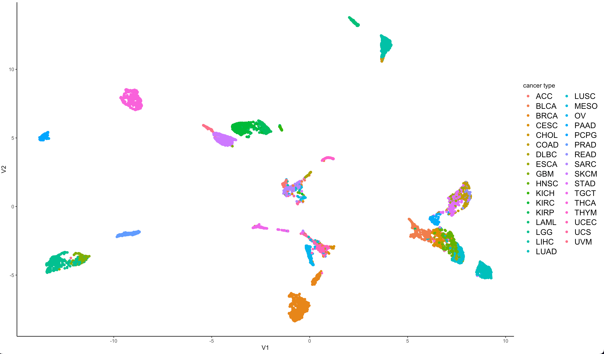
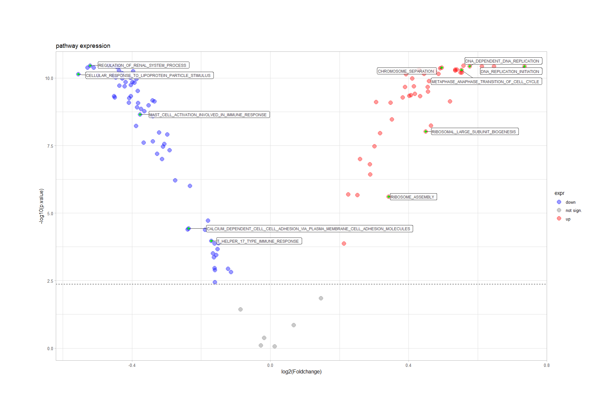
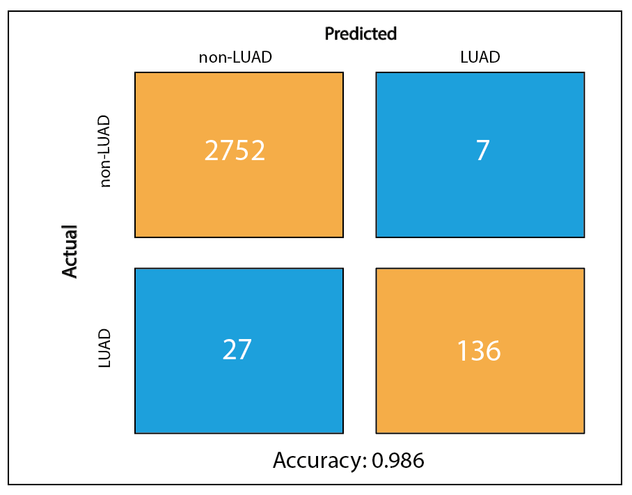

```{=tex}
\begin{titlepage}
\centering
    {\Large Ruprecht-Karls-Universität Heidelberg\\
        Fakultät für Biowissenschaften\\
        Bachelorstudiengang Molekulare Biotechnologie\\}

    {\vspace{\stretch{2}}}
    {\doublespacing{\usekomafont{title}}

        {\Huge Cancer Hallmark and Metabolic Pathways in Cancer}

      {\Huge Topic 02 Team 03}

        {\Huge Exploration of Lung Adenocarcinoma (LUAD)}

    }

    \vspace{\stretch{2}}
    {\Large Data Science Project SoSe 2022}

    \vspace{\stretch{2}}

    {\normalsize
        \begin{tabular}{rl}
            Authors & Paul Brunner, Marie Kleinert, Felipe Stünkel, Chloé Weiler\\
            Submitted on &18.07.2022\\
        \end{tabular}
    }

    \vspace{\stretch{1}}

\end{titlepage}
```
```{=tex}
\addchap{Abstract}
Lung adenocarcinoma (LUAD) is the most common type of lung cancer. Its poor early diagnosis rate and high mortality create a great demand to identify biomarkers improving diagnosis and prognosis. This study aims to determine driver genes suitable to predict LUAD based on a patient's gene expression pattern.

To this end a two RNA-seq datasets from The Cancer Genome Atlas, one containing molecular data from 33 different cancer types and one containing data from LUAD tissue and from corresponding healthy tissue were analysed based on gene expression and pathway enrichment. In an effort to characterize LUAD-specific deregulations, Gene Set Enrichment Analysis and Gene Set Variation Analysis were performed using the geneset list provided by the Molecular Signatures Database. 

Patients suffering from LUAD exhibit a general downregulation of the renal system but upregulation of HIF1 alpha. In comparison to other cancer types, LUAD expresses a more immunogenic and pro-inflammatory molecular signature. Moreover, genes involved in alveolal development show a notably higher expression rate. 

With the help of these findings a regression model was developed that helps predict LUAD and non-LUAD patients with 98.6 percent accuracy.

Our study provides a diverse analysis of driver genes and pathways underlying LUAD progression. Identifying differences between LUAD and healthy tissue, LUAD to itself and between LUAD and other cancer types suggests related diagnostic, prognostic and therapeutical value.
\clearpage
\tableofcontents
\clearpage
```
\addchap{Abbreviations}

+------------+------------------------------------------------------------------+------------+--------------------------------------------------+
| ADGRF1     | Adhesion G protein-coupled receptor F1                           | LGG        | Low grade glioma                                 |
+------------+------------------------------------------------------------------+------------+--------------------------------------------------+
| AGTR1      | Angiotensin II receptor 1                                        | LIHC       | Liver hepatocellular carcinoma                   |
+------------+------------------------------------------------------------------+------------+--------------------------------------------------+
| AML        | Acute myeloid leukemia                                           | LUAD       | Lung adenocarcinoma                              |
+------------+------------------------------------------------------------------+------------+--------------------------------------------------+
| AUC        | Area under the curve                                             | MSigDB     | Molecular Signature Database                     |
+------------+------------------------------------------------------------------+------------+--------------------------------------------------+
| BRCA       | Breast cancer                                                    | ORC        | Origin Recognition Complex                       |
+------------+------------------------------------------------------------------+------------+--------------------------------------------------+
| CALCA      | Calcitonin Related Polypeptide Alpha                             | OV         | Ovarian serous cystadenocarcinoma                |
+------------+------------------------------------------------------------------+------------+--------------------------------------------------+
| CD36       | Cluster of differentiation 36                                    | PAAD       | Pancreatic adenocarcinoma                        |
+------------+------------------------------------------------------------------+------------+--------------------------------------------------+
| CESC       | Cervical squamous cell carcinoma and endocervical adenocarcinoma | PC         | Principal component                              |
+------------+------------------------------------------------------------------+------------+--------------------------------------------------+
| CYP        | | Cytochrome p450                                                | | PCA      | | Principal Component Analysis                   |
+------------+------------------------------------------------------------------+------------+--------------------------------------------------+
| DLBC       | Lymphoid Neoplasm Diffuse Large B-cell Lymphoma                  | PCPG       | Pheochromocytoma and Paraganglioma               |
+------------+------------------------------------------------------------------+------------+--------------------------------------------------+
| EDNRB      | Endothelin receptor type B                                       | PPAR gamma | Peroxisome proliferator-activated receptor gamma |
+------------+------------------------------------------------------------------+------------+--------------------------------------------------+
| EMT        | Epithelial to mesenchymal transition                             | PRAD       | Prostate adenocarcinoma                          |
+------------+------------------------------------------------------------------+------------+--------------------------------------------------+
| ESCA       | Esophageal carcinoma                                             | RAS        | Renin-angiotensin system                         |
+------------+------------------------------------------------------------------+------------+--------------------------------------------------+
| FGA        | Fibrinogen alpha chain                                           | RNA-seq    | RNA sequencing                                   |
+------------+------------------------------------------------------------------+------------+--------------------------------------------------+
| GBM        | Glioblastoma multiformae                                         | ROC        | Receiver operating characteristic                |
+------------+------------------------------------------------------------------+------------+--------------------------------------------------+
| GSEA       | Gene Set Enrichment Analysis                                     | SARC       | Sarcoma                                          |
+------------+------------------------------------------------------------------+------------+--------------------------------------------------+
| GSVA       | Gene Set Variation Analysis                                      | SKCM       | Skin Cutaneous Melanoma                          |
+------------+------------------------------------------------------------------+------------+--------------------------------------------------+
| HIF1 alpha | hypoxia inducible factor 1 subunit alpha                         | TCGA       | The Cancer Genome Atlas                          |
+------------+------------------------------------------------------------------+------------+--------------------------------------------------+
| HNSC       | Head and neck squamous cell carcinoma                            | Th17       | IL-17--producing CD4 helper T cells              |
+------------+------------------------------------------------------------------+------------+--------------------------------------------------+
| INSL4      | Gene encoding insulin-like 4 protein                             | THCA       | Thyroid carcinoma                                |
+------------+------------------------------------------------------------------+------------+--------------------------------------------------+
| KICH       | Kidney chromophobe                                               | TPM        | Transcripts per million                          |
+------------+------------------------------------------------------------------+------------+--------------------------------------------------+
| KIRC       | Kidney renal clear-cell carcinoma                                | UCEC       | Uterine Corpus Endometrial Carcinoma             |
+------------+------------------------------------------------------------------+------------+--------------------------------------------------+
| KIRP       | Kidney renal papillary cell carcinoma                            | UMAP       | Uniform Manifold Approximation and Projection    |
+------------+------------------------------------------------------------------+------------+--------------------------------------------------+
| LAML       | Acute Myeloid Leukemia                                           | UVM        | Uveal melanoma                                   |
+------------+------------------------------------------------------------------+------------+--------------------------------------------------+
| LDL        | low-density lipoprotein                                          | VEGF       | Vascular endothelial growth factor               |
+------------+------------------------------------------------------------------+------------+--------------------------------------------------+

\clearpage

# Introduction

## Background

To this day, lung cancer is the leading cause of cancer death worldwide [@zhang2020\]. Lung adenocarcinoma (LUAD) is a form of non-small cell lung cancer which accounts for approximately 40% of lung cancer cases and which is characterized by a remarkably low 5-year overall survival rate of merely 18% \[@wang2020; @li2022\]. In theory, every cell is capable of developing into a cancer cell through acquisition of so-called hallmark capabilities that drive tumor formation due to numerous genetic mutations \[@hanahan2011; @peng2018]. In order to gain an insight into which mutations drive cancer development we revert back to the pan cancer project. The Cancer Genome Atlas (TCGA) is a publicly available collection of datasets that store the most important cancer-causing genomic alterations in order to create an 'atlas' of cancer genomic profiles [@tomczak2015]. In the Pan Cancer project, data is collected from thousands of cancer patients and subsequently analysed and interpreted in an attempt to gain a deeper understanding of the genomic changes that drive a normal cell to become cancerous. The TCGA project provides a vast amount of RNA sequencing (RNA-seq) data which makes it possible to go beyond static genome analysis and to gain an insight into the transcriptional landscape of a cell. Studying gene expression profiles of a given cell through monitoring RNA synthesis enables researchers to gain a deeper understanding of how gene expression is regulated in cells and its impact on the cell's phenotype [@marguerat2010].

## Computational Tools

### Uniform Manifold Approximation and Projection (UMAP)

Uniform manifold approximation and projection (UMAP) is a k-neighbor graph based algorithm that is used for non-linear dimension reduction [@smets2019] [@mcinnes2018]. After data normalization, the Euclidean distances between points in a two-dimensional space of the graph are calculated and a local radius is determined [@VERMEULEN2021119547]. In general the closer two points are to each other, the more similar they are. UMAP makes a density estimation to find the right local radius. A large number of k-nearest neighbors will ensure that more global structure is preserved whereas a smaller number of neighbors will ensure the preservation of more local structure [@mcinnes2018]. An alternative method for dimensionality reduction is principal component analysis (PCA) which is explained in detail in the appendix. UMAP is a newer method than PCA and it is generally believed to facilitate interpretation and grouping of data [@milosevic2022].

### Gene Set Variation Analysis (GSVA)

Gene set variation analysis (GSVA) is an unsupervised method to estimate pathway activities based on gene expression data. GSVA quantifies enrichment in a sample-wise manner independently of phentoypes which makes GSVA the most adequate method to perform on the `tcga_exp`. GSVA estimates a cumulative distribution for each gene over all samples. The gene expression values are then converted according to these estimated cumulative distributions into scaled values. Based on these new values, the genes are ranked in each sample. Next, the genes are classified into two distributions and a Komogorow-Smirnow statistic is calculated to judge how similar the distributions are to each other and to obtain an enrichment score (ES). A highly positive or negative ES indicates that the studied geneset is positively or negatively enriched compared to the genes not in the geneset, respectively. If the ES for a given geneset is close to zero, then the geneset is probably not differentially expressed compared to the genes not in the geneset [@hanzelmann2013]. An alternative method to evaluate gene scoring is gene set enrichment analysis (GSEA) which is explained in detail in the appendix.

## Objective

Knowing the devastating impact of LUAD on all those affected by the disease, we set out to learn more about its underlying genetic mutations. By comparing gene expression patterns in tumorous tissue to that in healthy tissue within one patient as well as to other cancer types, we hope to gain a better understanding of which metabolic deregulations are the root cause of LUAD and what makes LUAD unique. Identifying the precise genes that are up- or downregulated in LUAD tumor cells reveals the pathways most involved in tumor development and opens up new doors for cancer diagnostics. Not only do we hope to find a way to predict LUAD based on a cell's gene expression pattern but by revealing the driver genes of the disease, whole genome sequencing could be replaced by more efficient panel sequencing methods.

# Methods

An overview of all used packages can be found in the appendix (Appendix, **Tab. 7.1**).

## Our Data and Geneset Extraction

We were given four datasets, two of which contained RNA-seq data, one of which contained clinical annotations pertaining to one of the RNA-seq data frames and one of which contained a list of genesets for cancer hallmark analysis. The first RNA-seq dataset containing data from almost 10,000 TCGA cancer patients of 33 different tumor types was used to perform pan cancer analysis and to create a logistic regression model. The second RNA-seq dataset is a smaller data frame containing the TCGA expression data of tumor tissue and the corresponding healthy tissue for five different cancer types. It was used to perform a focused analysis. All expression data was already log2(TPM) transformed to reduce skewness in data and to make it more conform to a normal distribution. Here, TPM stands for 'Transcripts per million' and refers to a method of RNA-seq normalization in which one first accounts for gene length before adjusting for sequencing depth which helps to reduce type I and type II errors [@yuen2022].\newline The Molecular Signature Database (MSigDB) is a database offering a variety of annotated genesets publicly available for analysis. The import of genesets from MSigDB into RStudio can easily be performed using the R package "msigdbr" [@msigdbr] which allows for the extraction of species-specific genesets of the category of interest. The aim of this was to extract curated (C2) and ontology (C5 BP) genesets which were used for focused analysis as well as pan cancer analysis. The curated genesets that regulate the metabolism of cells were also used for comparison with given hallmark pathways that are often deregulated in cancer cells.

## Data cleanup on TCGA datasets

After checking for NAs in the big TCGA dataset, all genes that showed a standard deviation lower than the 50% quantile of the standard deviation distribution were removed. Using the BiomaRt package [@biomaRt2005] the biotypes of all genes were compared to biotypes of the given geneset list, as well as to the geneset lists retrieved from MSigDB. All genes linked to biotypes not part of the biotypes of said genesets and possible pseudogenes were removed. Moreover, the small TCGA dataset for LUAD patients was cleaned using the same workflow as explained before. However, this time only zero variance genes were deleted.\newline To uncover clusters in the data, a combination of a PCA and UMAP was conducted on the cleaned TCGA expression dataset. Aiming to minimize artefacts caused by correlating variables, a PCA using the `RunPCA` command from the Seurat package [@R-SeuratObject] was conducted [@mcinnes2018]. Afterwards, the UMAP analysis was done on the produced principle components using the uwot package [@uwot] and visualized with ggplot2 [@ggplot2]. After splitting the dataset into 33 data frames, one for each cancer type, the aforementioned workflow was then used on each of the cancer type subsets. To analyse the created plots, clusters k-means clustering [@R-base] was performed aiming to assign each of the patients to their corresponding cluster. The ideal number of clusters was evaluated using the silhouette method with function from the cluster package [@cluster]. To create a volcano plot with the EnhancedVolcano package [@enhancedvolcano], foldchanges between each cluster and the rest of the patients were calculated using the foldchange function [@gtools] and a two sided Wilcoxon test was conducted on each cluster and the rest of the data points.

## Differential Expression Analysis

A GSVA was conducted with the homonymous package to evaluate the enrichment of genes that play a role in the aforementioned pathways [@gsva]. This package enables multi-core calculations for reduction of calculation time. Two different geneset lists retrieved from MSigDB were used: gene ontology genesets and curated genesets, each containing roughly 3,000 genesets. Genesets that showed an overlap below 95% with the genes in the chosen dataset were removed. Afterwards, the output matrix was cleaned from pathways with a low standard deviation and then split into the different tumor types. Calculating the means per pathway over all patients of one tumor type resulted in a tumor type pathway enrichment matrix which was visualized using the ComplexHeatmap package [@complexheatmap]. The same workflow was repeated for each geneset in the large dataset as well as for the small dataset.

To assess how strongly pathway activity differs between tumor and normal tissue, a GSEA was performed using the fgsea package [@fgsea]. A previously created signed-rank list of decreasing p-values and a combination of metabolism and hallmark genesets served as input for the pathway list. An enrichment score and a leading edge containing the genes that contribute most to the enrichment score were calculated for each pathway. To sort the pathways by expression rate, the mean expression of their leading edges was calculated and visualized in a barplot using theggplot package [@gplots].

## Regression

In order to identify LUAD risk patients from RNA-seq data, a logistic regression model was trained through binary classification between LUAD and non-LUAD patients. First of all, the cleaned dataset was split by a 70 to 30 percent ratio into a training and testing dataset respectively. In an effort to find genes that could be used as explaining variables, gene foldchanges [@gtools] between LUAD and other cancer types were calculated using the large cleaned dataset. The genes were tested for correlation and in the case of highly correlating genes, one of them was removed. The 10 most over- and 10 most underexpressed genes were chosen for further testing. As a quality control, PCA [@R-SeuratObject] and UMAP [@uwot] were conducted on all patients for these 20 chosen genes. A first rough model was trained using all 20 of the chosen genes and the glm function [@R-base]. The blorr package was used to determine the best composition of the given 20 genes [@blorr]. With the best configuration, the final model was trained on the training dataset. Using the native predict function [@R-base], the model was evaluated by predicting whether the patients of the testing dataset were LUAD patients. The resulting probabilities were transformed into predictions for LUAD or non-LUAD using a cutoff value of 50%. Next a confusion table was used to estimate the false-positive and false-negative rates using the known tumor type of each patient and comparing that to the prediction of the model. As a final evaluation step the package ROCR [@rocr] was used to create a ROC curve. <!-- add your chapters here -->

# Results

## Data cleaning

The analysis of the expression dataset showed no NAs in any of the patients, which meant none of the patients had to be removed in order to continue working with the dataset. After the further clean-up process described in part 3.4 the expression dataset could be reduced from over 60.000 to roughly 17.000 genes while keeping all 9741 patients. The tumor vs. normal dataset for LUAD patients was reduced to around 17.000 genes for 58 patients.

## Cancer hallmark pathways

The similarity between chosen pathways was measured using the Jaccard index and afterwards visualized in a heatmap (Appendix, \textbf{Fig. \ref{fig:Jaccard}}). Similarity is generally low and the Jaccard index does not exceed 0.2. The highest amount of shared genes is found in the alanine, aspartate and glutamate metabolism with glutamine metabolism.

## Focused analysis

Overall, as shown in \textbf{Fig. \ref{fig:GSEA barplot}} more upregulated than downregulated pathways were observed. Among the upregulated, Meta_HIF1 and the ascorbate and alderate metabolism pathways presented with the highest mean as well as some pathways associated with nucleotide, amino acid, and sugar metabolism. Downregulated pathways are mainly linked to the immune response but also to the metabolism of specific amino acids and fatty acids. The two most significantly downregulated pathways regulate linolenic acid and nitrogen metabolism.

The heatmap (\textbf{Fig. \ref{fig:heatmap GSVA}}) shows two recognizable groups with different expression patterns. The left half shows only tumor samples while the right half shows almost exclusively healthy samples, with a few tumor samples among them framed in black. \\newline Strong differences can be seen in the pathways marked in violet. Many of the pathways that are strongly upregulated in tumor cells are associated with DNA replication or chromosome distribution during mitosis.The pathways marked in blue are connected to immune response, for example that of T-helper 17 cells. In this case, some tumor samples show upregulation while most show downregulation. In normal tissue the expression of most pathways is clearly upregulated with a few exceptions near the right margin. The volcano plot (\textbf{Fig. \ref{fig:volcano GSVA}}) confirms these findings.

```{r heatmap GSVA, echo = FALSE, message=FALSE, fig.align='center', fig.cap='\\textbf{Heatmap for comparing pathway expression in normal and tumor tissue } The heatmap shows the GSVA results for the small TCGA dataset. On the x axis one can see the normal and tumor samples, while the y axis shows the pathways with the highest standard deviation. The expression of each pathway is color-coded, from high expression (red), to low expression (blue).', out.width='0.7\\linewidth'}


```

A total of four pathways with particularly significant p values were selected. They showed high absolute fold changes. In (\textbf{Appendix Fig. \ref{fig:volcano pathways}}), genes of these pathways are highlighted in black and some with particularly low p values are labeled. The red colored genes are all genes in our cleaned TCGA tumor normal dataset that are significantly over expressed over all patients in tumor tissue compared to normal tissue. The blue colored genes imply the opposite. In gray, one can see insignificantly up or downregulated genes. Pathways involved in DNA replication and cell cycle progression were globally overexpressed (\textbf{Appendix Fig. \ref{fig:volcano pathways}}). Two down regulated pathways, namely renal system regulation and cellular response to lipoprotein particle stimulus are seen in \textbf{Appendix Fig. \ref{fig:volcano pathways}}(D, E). PPAR gamma or CD36 seem to be significantly down-regulated in the latter pathway.

## Pan cancer analysis

### Visualization of TCGA patients of different tumor types

The first step to pan cancer comparison was to evaluate potential clusters in our data. Dimension reduction of the cleaned data conducted by performing PCA and UMAP results in the plot shown in (\textbf{Fig. \ref{fig:UMAPexpression}}). Data point were colored according to the cancer types they belong to in order to find clusters. Based on the 33 different types occurring in the dataset, the reduced data results in approximately 16 clusters. Notably, BRCA, LIHC, KIRP, SKCM, UVM, THCA, PCPG and PAAD exhibit well defined clustering. Additionally, LGG and GBM form a united cluster. Patients suffering from LUAD show a similar gene expression indicated by the isolated, turquoise cluster in the right, bottom corner.

```{r UMAPexpression, echo = FALSE, message=FALSE, fig.align='center', fig.cap='\\textbf{UMAP plot on TCGA expression dataset} The x-axis is defined by the first umap component, whereas the y-axis assigned to the second component. The data plots are colored by the patients cancer type', out.width='0.65\\linewidth'}



```

### Pathway enrichment

The diagnosis of the cancer type a patient suffers from is not only based on the cancer's location in the body but by the molecular signature it exhibits. The deregulation of pathways is characteristic for each cancer type. Aiming to identify differences in pathway activities based on the cancer type, two geneset list were extracted from MSigDB, as described in section 3.3. One list contained curated genesets whereas the other list contained ontology genesets. GSVA was performed twice on the TCGA expression dataset; once using the curated geneset list and once with the ontology geneset list for quality control. By utilizing the genesets separately, the better fitting geneset for the analysed dataset could be selected (Appendix, \textbf{Fig. \ref{fig:UMAPc5}}; Appendix, \textbf{Fig. \ref{fig:appendix_umapC2}}). The selected geneset list contains only ontology genesets that overlap with the genes from the expression data by more than 95%. Cancer types that result in an isolated and well defined cluster after GSVA are LIHC, KIRK, THCA, PRAD, PCPG, LGG and LAML.

Based on the geneset enrichment matrix created with GSVA, a pathway enrichment heatmap was created (\textbf{Fig. \ref{fig:GSVAheatmap}}). Performing k-means clustering, three clusters of cancer types were identified. The cancer types allocated to the first cluster can be categorized into kidney carcinomata, gliomata, carcinomata of the sexual organ as well as thyroid and liver carcinoma. The other two clusters exhibit no specific subcategories explaining similar pathway deregulation patterns. Cancer types belonging to cluster one show a general strong down regulation of pathways in comparison to the other cancer types. Cluster 2 contains cancer types with distinct deregulation of pathways. The third cluster exhibits a strong deregulation of pathways relatively to the other cancer types, some being upregulated while others are severely downregulated. The first cluster includes pathways that regulate the cell cycle, DNA replication and chromatid segregation.Cancer types included in the first cluster inhibit immune activation.

```{r GSVAheatmap, echo = FALSE, message = FALSE, fig.align = 'center', fig.cap = '\\textbf{Pathway enrichment heatmap.} The clustering of cancer types was conducted using kmeans.', out.width = '0.85\\linewidth'}

knitr::include_graphics("output/3_gsva_heatmap_C5.pdf")

```

### Geneset enrichment comparison between LUAD and other cancer types

The identification of marker pathways for LUAD and the comparison of geneset enrichment is a central part of this project. The resulting heatmap and volcano plot could then be used to gather information of the different molecular signatures of LUAD and of other cancer types and gave critical information for the following regression analysis. The volcano plot (\textbf{Fig. \ref{fig:VolcanoplotKombi}} A) helps with analysing the exact pathways that differ in activity between LUAD patients and other cancer patients.

```{r VolcanoplotKombi, echo = FALSE, message = FALSE, fig.align = 'center', fig.cap = '\\textbf{A Volcano plot for geneset enrichment in LUAD compared to all other cancer types of the TCGA dataset} log2 foldchange values between LUAD and non-LUAD patients as well as the -log10 values of the corresponding p-values from the two-sided Wilcoxon test are shown. Dotted lines indicate the alpha value and foldchange values of -1 and 1.\\textbf{B Volcano plot comparing the two observed clusters.} Each datapoint is one gene, the most differentially expressed genes are marked by name.', out.width = '0.78\\linewidth'}


```

The volcano plot shows several differentially expressed pathways in LUAD. The majority of them are upregulated. Most notably, a group of pathways related to inflammation and immune activation show a significant increase in activity in LUAD. Additionally, a pathway regulating mast cell activation is upregulated. Pathways concerning DNA replication and RNA translation seem to be downregulated in LUAD, as well as genesets concerning angiogenesis. Several genesets show a significant difference in expression, however the absolute value difference between the two groups does not meet our criteria of being at least 1.

### Comparison of Clusters Within LUAD

After running separate PCA and UMAP analysis on patients for each tumor type the question arose how the patients within one tumor type differ from each other. The UMAP plots for three of the most clearly clustering tumor types can be seen in Figure (Appendix \textbf{Fig. \ref{fig:threeUMAPs}}).

LUAD also clustered into two clusters, however these were not as clear as the ones shown before (Appendix, \textbf{Fig. \ref{fig:appendix_luadumap}}). To further our understanding of LUAD the gene activity of the clusters was compared using a volcano plot (\textbf{Fig. \ref{fig:VolcanoplotKombi}} B).

## Regression

The logistic model was trained on the TCGA expression dataset. The model's goal was to predict whether a cancer patient suffers from LUAD or not. In order to be used reliably, the model has to be precise enough. Testing of our model revealed the following characteristics: The model predicts 136 LUAD patients correctly, as well as 2752 non-LUAD cases. Also shown in the confusion table (\textbf{Fig. \ref{fig:confusionmatrix}} (A)) are the 27 false-negative occurrences and 7 false-positive occurrences. This results in an accuracy of 0.986.

For further evaluation a ROC plot was produced which enables an estimation of model performance in relation to the false-positive rate (\textbf{Fig. \ref{fig:rocplot}} (B)). The ideal estimator would have an area under the curve (AUC) of 1 and would fill out the top left corner. The trained regression model exhibits an AUC of 0.9159 and a nearly linear increase.

```{r rocplot, echo = FALSE, message = FALSE, fig.align = 'center', fig.cap = '\\textbf{A) Confusion matrix} and \\textbf{B) ROC plot} of the trained logistic model with an AUC value of \\textbf{0.9159}.', out.width = '0.85\\linewidth'}


```

# Discussion

## Focused Analysis

The mean expression per pathway is shown in \textbf{Fig. \ref{fig:GSEA barplot}}. Of all pathways, HIF1 mean expression was the most elevated which is plausible as it plays an important role in tumor progression and metastasis [@ren2013]. Pathways linked to nucleotide, amino acid and sugar metabolism like ascorbate and aldarate metabolism are shown to be generally enriched in tumor tissue which is confirmed by previous research [@araujo2018]. Gamma linolenic acid suppresses HIF1 alpha induced proliferation and invasion of non-small cell lung cancer cells [@wang2020]. Therefore it is entirely plausible that the linoleic acid pathway has the lowest mean expression of all observed pathways. As indicated in our results (\textbf{Fig. \ref{fig:volcano GSVA}}), pathways linked to DNA replication and cell cycle regulation are strongly overexpressed in tumor tissue compared to normal tissue. Immune response mechanisms like T-helper 17 type immune response were partly up and partly downregulated in tumor tissue. Th17 cells play a crucial role in promoting chronic tissue inflammation which has often been linked to the development of cancer [@chang2014]. However Th17 function may vary accordingly to stage of disease [@wilke2011]. This suggests that the expression rate of the T-helper 17 type immune response can vary between samples which would lead to inconclusive results during gene expression analysis. Analysis of \textbf{Fig. \ref{fig:volcano pathways}} yielded that the renal system pathway shows a particularly low expression rate. The renin-angiotensin system (RAS) plays an important role in suppression of lung cancer development, therefore our findings confirm our theoretical expectations [@xiong2021]. Overall our findings for the most differentially expressed pathways could be backed by previous research.

## Pan Cancer Analysis

### Identification of Clusters in Gene Expression Data

Visualization of the data after dimension reduction reveals strong clustering based on the cancer types. This indicates that patients diagnosed with certain cancer types, particularly LUAD, BRCA, LIHC, KIRP, and UVM developed a unique gene expression pattern. Due to the fact that LGG and GBM cluster together, a similar pattern of genetic mutations can be concluded. The latter observation is unsurprising as both tumor types are glioma.

### Pathway Enrichment

To minimize the information loss, we performed GSVA with two different geneset lists and chose the ontology geneset list which retained the most information. By visualizing the pathway enrichment relative to the cancer type the formation of three cancer type clusters can be observed (\textbf{Fig. \ref{fig:GSVAheatmap}}).This can be explained by the fact that several cancer types can be assigned to a joint cancer class like glioma and kidney carcinomata. No higher category could be assigned to the second cluster as it showed no distinct deregulation pattern. The third cluster contains cancer types related to cells of internal organs.The three pathway clusters that can be seen in the heatmap correspond to cell cycle and genome regulation, regulation of different phases of metastasis, and activation of the immune response. Cell cycle deregulation are cancer hallmarks and therefore at the base for tumor progression, as they can promote unregulated growth [@bruce1983]. It is important to highlight that our analysis is relative to different cancer types and does not have any informative value concerning the relation to healthy cells. Accordingly, cancer types that exhibit downregulation of cell cycle pathways only show aggressive spread than other cancer types. The first cluster of cancer types, particularly kidney cancer and thyroid adenocarcinoma, result in a relative downregulation of these pathways. While our findings in THCA are according to our expectations [@coca2020], the strong downregulation in kidney cancer is not supported by other studies. A cancer's ability to metastasize depends on its location and molecular signature [@bruce1983]. Budczies et al. found melanoma, breast cancer and lung cancer to feature a high metastatic potential, while cancer cells deriving from the liver and sexual organs show the lowest rates of metastasis [@budczies2015]. Our findings confirm this research. PAAD resulted in the most severe upregulation of metastasis related pathways which is also supported by studies [@ayres2019]. Our analysis further revealed downregulation of metastatic pathways in liver and reproductive cancers that is supported by literature [@budczies2015]. Cancer types of the first cluster show a severe downregulation of immune activation pathways. This clustering is according to our expectations as cancer types of each cluster can be categorized by immune-infiltration [@wang2020]. Even though UCS is assigned to cluster two, it results in a strongly decreased immune pathway activity. This is confirmed by first studies [@ali2020]. In contrast, DLBC and HNSC are examples for cancer types in which immune infiltration is severly upregulated. In this case inflammation can support the tumor mircoenvironment because it promotes tumorigenesis by supplying growth and survival factors. Tamma et al. observed the same phenomenon in DLBC [@tamma2020] and increased inflammatory pathways of HNSC were verified by the studies of He et al. [@he2022]. Overall, our results show great compliance with previous studies. Nevertheless, some findings do not conform to expectations as they imply a different transformation of some cancer types. Possible reasons for these discrepancies are the chosen pathways and the general loss of information during conduction of GSVA.

### Geneset Enrichment Comparison Between LUAD and Other Cancer Types

Using the volcano plot which compared geneset enrichment of LUAD and non-LUAD patients several conclusions can be drawn.

Due to the overexpression of inflammatory and immune activity pathways, it can be deduced that LUAD is generally more immunogenic than the other cancer types. This explains the increase in tissue inflammation and T-cell selection as well as mast cell activation ( \textbf{Fig. \ref{fig:GSVAheatmap}}). The upregulation of mast cell activity further supports the hypothesis that LUAD is more immunogenic as mast cells play a vital role in inflammatory and constrictory processes by secretion of cytokines [@tatarouglu2004]. These findings are supported by Xu *et al.*, who claim that especially in the immunity high LUAD subtype a higher expression in immune system pathways and pro-inflammatory genes can be found. This also correlates with better response to immunotherapy [@xu2020].

Furthermore, the increased expression of alveolal developmental genes fits our expectation, as LUAD is a non-small cell lung cancer and thus growth of alveoli should be overexpression. Sainz de Aja *et al.* even suspect the affected alveolar progenitor cells to be the source of the tumor growth [@sainz2021].

The downregulation of genesets involved in replication compared to other genesets leads to the conclusion that LUAD does not exhibit the same increase in replication as other cancer types do. Furthermore, angiogenesis seems to be less advanced in LUAD as in other cancer types. Tataroğlu *et al.* suggest that the level of angiogenesis expression in LUAD patients is connected to the cancer stage the patients find themselves in. As our dataset provided patients over all stages the expression level of angiogenesis could have been skewed by patients in low angiogenesis stages [@tatarouglu2004].

In conclusion LUAD could be described as a rather immunogenic and pro-inflammatory cancer, protruding from alveolar progenitor cells. Immunotherapy is a promising therapy approach for LUAD patients, especially for the immunity high subtype [@xu2020].

### Comparison of Clusters Within LUAD

The UMAP plots of SARC, ESCA and BRCA show perfectly clear clusters, which were also confirmed by k-means clustering. LUAD did not cluster as clearly, however further analysis of the differences between its patients was possible by using volcano plots. The volcano plot clearly shows that the two clusters differ in expression of certain genes. Most of the genes that are differentially expressed are connected to signal transmission over various pathways. For example ADGRF1 which influences the way GPCRs behave in the two LUAD clusters and thus even influences CREB activity, which can promote anti-tumor cell programs [@abdulkareem2021]. INSL4 is normally found during embryonic development as it can bind the insulin-like growth factor receptor. In LUAD it is significantly overexpressed which is unsurprising insofar that cancer progression results in reactivation of early development genes [@veitia1998]. Additionally, FGA, the fibrinogen alpha chain, differs, meaning a difference in blood clotting [@freissmuth2016]. It was shown that the two found clusters differ in very specific aspects of biological processes, namely CREB activation, growth by INSL4, blood clotting capabilities and calcium household by CALCA expression. We expected to find distinct clusters corresponding to the LUAD subtypes found by Qin *et al.* which are characterized by immune activity [@qin2020]. However even in the most differentially expressed genes we found no significant difference in immune activity between the clusters. Qin *et al.* had access to both genomic and transcriptomic data and analysed the datasets specifically for changes in immune response which influences the results.

## Regression

Since LUAD patients clustered clearly throughout the UMAP plot before, we expected to be able to built a rather robust logistic regression to differentiate between LUAD and non-LUAD patients. This expectation was further fueled by the LUAD patients also clustering during quality control using only the genes we chose as our explaining variables (\textbf{Fig. \ref{fig:appendix_regressionqc1}}). The confusion table shows a low amount false-positives and a high number of true-negatives. The model seems to be able to recognize clear non-LUAD patients fairly easily. However there are 27 false-negatives, which means that 16.6 % of all LUAD patients have not been labelled right. The reason for those false-negatives could be the fact that while LUAD patients show a clear cluster there are some non-LUAD patients in the same cluster. The patients that are close to these other cancer types are at risk of wrongfully being labelled as the neighbouring cancer type, as it is shown in the quality control plot (\textbf{Fig. \ref{fig:appendix_regressionqc2}}). Nevertheless due to the high amount of patients (2921 total patients in the testing dataset) the accuracy of 98.6 % shows a rather reliable model. The models performance is further underlined by the ROC curve that was created during analysis. In this case the ROC curve shows a steep progression at first and then inclines linearly. The area under curve of 0.9159 ranks this model as reliable, as generally AUC closer to 1 are regarded as good [@narkhede2018]. In conclusion this model could be used to reduce the amount of genes that have to be screened by RNA-seq in order to diagnose a patient with LUAD. However there still is potential to differentiate between more cancer types by using a multinomial logistic regression. Additionally neural-networks have been shown to be a more reliable and functional alternative to logistic regression. Way *et al.* even showed this possible solution on the same TCGA dataset [@way2018].

## Conclusion

Over the course of the project we were able to discern the genes that are differentially expressed in LUAD cells compared to normal cells and to assign them to their respective pathways. Furthermore, we managed to distinguish LUAD to other cancer types through analysis of their respective gene expression patterns. The vast majority of our findings could be confirmed by preexisting research. The crowning achievement of the project is a logistic regression model that allows us to predict LUAD with 98.6 % accuracy and to reduce the amount of genes that would have to be screened to diagnose a patient with LUAD.

## Outlook

Performance of UMAP and PCA on our data (\textbf{Fig. \ref{fig:appendix_luadumap}}) showed that LUAD forms two distinct clusters. Further analysis may reveal the genetic differences within LUAD that lead to clustering. Different LUAD patient clusters might belong to different immune subtypes and thus respond differently to immunotherapy. A link between immune activity in LUAD and metastasis formation could be further researched, as roughly half of LUAD patients develop brain metastases [@shih2020]. It is a well-known fact that lung cancer is a smoker's disease therefore further research could be to investigate differences in smokers and non-smokers that suffering LUAD. However, in recent years studies have found that lung cancer incidence is decreasing in smokers and increasing in non-smokers. The same study states that the genomic profile of lung cancer in non-smokers differs from that in smokers [@qiu2015]. Inspired by this study, a possible next step would be to subgroup the data into smokers and non-smokers and to compare the two groups in order to determine which pathways are differentially expressed and if the results of Qiu *et al.* can be replicated with our data. For an easier diagnosis during biopsy of early stage cancer cells an improved logistic regression model could be developed. The regression model we developed over the course of this project could be further sophisticated to additionally predict the cancer stage on the grounds of a patient's genomic profile as well as other factors like age or smoking habits. With enough training, this model could help determine an adequate treatment plan with reduced patient trauma. In order to really enhance analysis and modelling, not only transcriptomic data but also epigenetic data could be used to gain more insights into the cancer's behavior, as strategic DNA methylation or demethylation is a crucial driver in many cancer types [@esteller2008]. In the end one of the most important steps following our bioinformatic analysis would be experimental validation of our findings. In particular the differences in tissue and cells could be studied using and comparing immunostained tissue slides from the TCGA project.

\clearpage

# References

::: {#refs}
:::

\clearpage

# Appendix

All statistical analyses were done in an R-environment [@R-base].

+--------------+--------------------------------------------------------------------------------------------+--------------------+
| Package Name | Application                                                                                | **Reference**      |
+==============+============================================================================================+====================+
| babyplots    | create interactive 3D visualizations                                                       | @babyplots         |
+--------------+--------------------------------------------------------------------------------------------+--------------------+
| bayesbio     | calculate Jaccard coefficients                                                             | @bayesbio          |
+--------------+--------------------------------------------------------------------------------------------+--------------------+
| BiocParallel | novel implementations of functions for parallel evaluation                                 | [@biocparallel]    |
+--------------+--------------------------------------------------------------------------------------------+--------------------+
| biomaRt      | access to genome databases                                                                 | @biomaRt2009       |
+--------------+--------------------------------------------------------------------------------------------+--------------------+
| blorr        | building and validating binary logistic regression models                                  | @blorr             |
+--------------+--------------------------------------------------------------------------------------------+--------------------+
| cinaR        | combination of different packages                                                          | @cinaR             |
+--------------+--------------------------------------------------------------------------------------------+--------------------+
| cluster      | cluster analysis of data                                                                   | @cluster           |
+--------------+--------------------------------------------------------------------------------------------+--------------------+
| Complex      | arrange multiple heatmaps                                                                  | [@complexheatmap]  |
|              |                                                                                            |                    |
| Heatmap      |                                                                                            |                    |
+--------------+--------------------------------------------------------------------------------------------+--------------------+
| Enhanced     | produce improved volcano plots                                                             | [@enhancedvolcano] |
|              |                                                                                            |                    |
| Volcano      |                                                                                            |                    |
+--------------+--------------------------------------------------------------------------------------------+--------------------+
| enrichplot   | visualization of geneset enrichment results (GSEA)                                         | @enrichplot        |
+--------------+--------------------------------------------------------------------------------------------+--------------------+
| FactoMineR   | perform principal component analysis (PCA)                                                 | @FactoMineR        |
+--------------+--------------------------------------------------------------------------------------------+--------------------+
| fgsea        | Run GSEA on a pre-ranked list                                                              | @fgsea             |
+--------------+--------------------------------------------------------------------------------------------+--------------------+
| ggplot2      | visualization of results in dot plots, bar plots and box plots                             | @ggplot2           |
+--------------+--------------------------------------------------------------------------------------------+--------------------+
| ggpubr       | formatting of ggplot2-based graphs                                                         | @ggpubr            |
+--------------+--------------------------------------------------------------------------------------------+--------------------+
| ggrepel      | creates non-overlapping text labels for ggplot2-based graphs                               | @ggrepel           |
+--------------+--------------------------------------------------------------------------------------------+--------------------+
| grid         | implements the primitive graphical functions that underlie the ggplot2 plotting system     | @grid              |
+--------------+--------------------------------------------------------------------------------------------+--------------------+
| gridExtra    | arrange multiple plots on a page                                                           | @gridExtra         |
+--------------+--------------------------------------------------------------------------------------------+--------------------+
| GSVA         | Run GSVA on a dataset                                                                      | [@gsva]            |
+--------------+--------------------------------------------------------------------------------------------+--------------------+
| gplots       | plotting data                                                                              | [@gplots]          |
+--------------+--------------------------------------------------------------------------------------------+--------------------+
| gtools       | calculate foldchange, find NAs,                                                            | @R-gtools          |
|              |                                                                                            |                    |
|              | logratio2foldchange                                                                        |                    |
+--------------+--------------------------------------------------------------------------------------------+--------------------+
| knitr        | creation of citations using write_bib                                                      | @knitr2014         |
+--------------+--------------------------------------------------------------------------------------------+--------------------+
| limma        | "linear models for microarray data"                                                        | @limma2015         |
+--------------+--------------------------------------------------------------------------------------------+--------------------+
| msigdbr      | provides the 'Molecular Signatures Database' (MSigDB) genesets                             | @msigdbr           |
+--------------+--------------------------------------------------------------------------------------------+--------------------+
| parallel     | allows for parallel computation through multi core processing                              | @parallel          |
+--------------+--------------------------------------------------------------------------------------------+--------------------+
| pheatmap     | draw clustered heatmaps                                                                    | @pheatmap          |
+--------------+--------------------------------------------------------------------------------------------+--------------------+
| RColorBrewer | provides color schemes for maps                                                            | @RColorBrewer      |
+--------------+--------------------------------------------------------------------------------------------+--------------------+
| ROCR         | visualizing classifier performance                                                         | @rocr              |
+--------------+--------------------------------------------------------------------------------------------+--------------------+
| scales       | helps in visualization: r automatically determines breaks and labels for axes and legends  | @scales            |
+--------------+--------------------------------------------------------------------------------------------+--------------------+
| Seurat       | includes RunPCA function                                                                   | @R-SeuratObject    |
+--------------+--------------------------------------------------------------------------------------------+--------------------+
| tidyverse    | collection of R packages, including ggplot2                                                | @tidyverse         |
+--------------+--------------------------------------------------------------------------------------------+--------------------+
| uwot         | performs dimensionality reduction and Uniform Manifold Approximation and Projection (UMAP) | @uwot              |
+--------------+--------------------------------------------------------------------------------------------+--------------------+

: **Used packages in alphabetical order.**

## Additional Computational Tools

### Jaccard index

The Jaccard index is a widely known measure for the similarity between finite sample sets and is defined as the intersection of the sample sets devided by their union. The restricted domain ranges from zero to one. A Jaccard index close to one indicates a high similarity of the sample sets [@jaccard1901].

### Principal Component Analysis (PCA)

Principal component analysis (PCA) constitutes an additional tool for dimensionality reduction besides UMAP.\newline Principal component analysis (PCA) is a procedure used to perform linear dimension reduction. The goal is to reduce the dimension of a given dataset whilst losing as little information as possible by retaining a maximum of the standardized dataset's variation [@ringner2008].\newline Principal components (PC) are a set of new orthogonal variables that are made up of a linear combination of the original variables. Principal components display the pattern of similarity of the observations and of the variables as points in maps [@abdi2010]. By convention, the PCs are ordered in decreasing order according to the amount of variation they explain of the original data [@ringner2008]. It is important to note that all PCs are uncorrelated.\newline PCA is a useful tool for genome-wide expression studies and often serves as a first step before clustering or classification of the data. Dimension reduction is a necessary step for easy data exploration and visualization [@ringner2008].

### Gene Set Enrichment Analysis (GSEA)\newline

Gene set enrichment analysis (GSEA) is a computational method that is used to determine whether two pathway expression states are significantly different from each other [@subramanian2007]. Two datasets are compared and the genes are sorted from the most to the least differential expression between the datasets according to their p-values. This creates a ranked list (L). Referring to an *a priori* defined set of genesets (S), the goal is to locate for each pathway of (S) where its corresponding genes fall in (L) and find a discerning trend. To determine the distribution of the genes from pathway (S) in (L), an enrichment score is calculated for each pathway. For this, a running-sum statistic is calculated as the list (L) is ran through. The running-sum is increased every time a gene belonging to the pathway in question is encountered and decreased otherwise. The enrichment score is defined as the maximum deviation from zero of the running-sum. Lastly, adjustment for multiple hypothesis testing is performed by normalizing the enrichment score for each pathway to account for its size and a normalized enrichment score is obtained.[@subramanian2005]

```{r Jaccard, echo = FALSE, message=FALSE, fig.align='center', fig.cap='\\textbf{Jaccard Coefficients of hallmark genesets and metabolism genesets.} The x-axis is defined by the given hallmark genesets, whereas the y-axis is assigned to the selected metabolism geneset.', out.width='0.75\\linewidth'}
knitr::include_graphics("output/2_geneset_heatmap_metabolism_vs_hallmarks.pdf")
```

```{r GSEA barplot, echo = FALSE, message=FALSE, fig.align='center', fig.cap='\\textbf{Barplot for the mean regultion of hallmark gene sets and metabolism gene sets.} Pathways are sorted by their mean expression. The x-achsis shows the mean expression and the y-achsis shows the pathways. Each pathway is colored according to regulation state.', out.width='75%'}


```

```{r volcano GSVA, echo = FALSE, message=FALSE, fig.align='center', fig.cap='\\textbf{volcano plot comparing pathway expression in normal and tumor tissue } The -log10 of the p values are plotted against the log2(foldchange) of each pathway. The regulation is colored accordingly)).', out.width='0.75\\linewidth'}



```

```{r volcano pathways, echo = FALSE, message=FALSE, fig.align='center', fig.cap='\\textbf{Volcano plot showing gene expression for selected pathways} The plots show the number of genes in each pathway and the percentage of significantly over expressed (red), significantly under expressed (blue) and not significant differentially expressed genes (gray). The differential expression referes to the change of mean expression over all patients for each gene form normal to tumor tissue. The selected pathways were: DNA replication initiation (top left), metaphase anaphase transition of cell cycle (bottom left), regulation of renal system process (top right) and cellular response to lipoprotein particles (bottom right) The x-axis is defined by the given hallmark genesets, whereas the y-axis is assigned to the selected metabolism geneset.', out.width='0.75\\linewidth'}

```

```{r appendix_luadumap, echo = FALSE, message = FALSE, fig.align = 'center', fig.cap = '\\textbf{PCA UMAP plot of LUAD} ', out.width = '0.85\\linewidth'}

knitr::include_graphics("./output/3_umap_clustering_LUAD.png")
```

```{r UMAPc5, echo = FALSE, message=FALSE, fig.align='center', fig.cap='\\textbf{Pathway enrichment based on cancer type.} The x-axis is defined by the first umap component, whereas the y-axis assigned to the second component. The data plots are colored by the patients cancer type', out.width='0.8\\linewidth'}

knitr::include_graphics("./output/3_gsva_pcaumap_c5.png")

```

```{r appendix_umapC2, echo = FALSE, message = FALSE, fig.align = 'center', fig.cap = '\\textbf{Clustering after GSVA performed with curated genesets.} Colored by assigned value by the trained model to asses quality of model', out.width = '0.80\\linewidth'}

knitr::include_graphics("./output/3_gsva_pcaumap _c2.pdf")
```

```{r confusionmatrix, echo = FALSE, message = FALSE, fig.align = 'center', fig.cap = '\\textbf{Confusion table} for prediction on test datast containing 2921 patients with 163 LUAD patients.', out.width = '0.4\\linewidth'}


```

```{r appendix_regressionqc1, echo = FALSE, message = FALSE, fig.align = 'center', fig.cap = '\\textbf{Quality control UMAP plot for regression.} Shows that LUAD cluster when gene expression dataset is subset to only include explaining variables, colored by cancer type ', out.width = '0.80\\linewidth'}


```

```{r appendix_regressionqc2, echo = FALSE, message = FALSE, fig.align = 'center', fig.cap = '\\textbf{Quality control UMAP plot for regression.} Colored by assigned value by the trained model to asses quality of model', out.width = '0.80\\linewidth'}

knitr::include_graphics("./output/5_QC_assigned.pdf")
```
